name: inverse
layout: true
class: middle, center, inverse

---

# R Case Studies from a Software Engineer
### by Charlie Chen ( [@Carolusian](https://github.com/carolusian) )
### 21 Apr 2017 @ HKBU

---

layout: false
class: middle, center

# The 1st Case: Identify the Reason of a Increase of CDN Cost

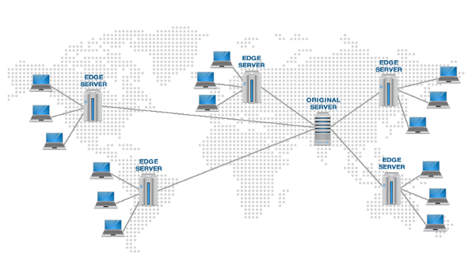

source: http://www.cdnreviews.com/

---

layout: false
class: middle

# The 1st Case: Identify the Reason of a Increase of CDN Cost

* Background
  * News website or apps commonly use card list to display news in a combination of news titles and **images**
  * Images are normally hosted by CDN (Content Distribution Network)
  * CDN service does cost money

---
class: middle

# The 1st Case: Identify the Reason of a Increase of CDN Cost
  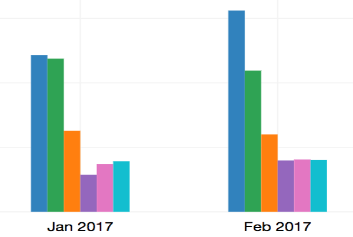


---

class: middle

# The 1st Case: Identify the Reason of a Increase of CDN Cost

* Background
  * One day, I observed there was an increase of the CDN cost (the first blue bar).
  * I made a guess: the image size changed
  * I wrote some R code to double check

---

class: middle

# The 1st Case: Identify the Reason of a Increase of CDN Cost

```bash
aws s3 ls s3://{{bucket_name}}/{{folder_path}} > {{yyyymm.txt}}
cat {{yyyymm.txt}} | awk '{ print $3}' > {{yyyymm.csv}}
```

```r
df <- read.csv('{{yyyymm.csv}}', header=F) / 1024
colnames(df) <- c('size')
df <- df[df$size < 1000, ]

breaks <- seq(from=0, to=1001, by=100)
h <- hist(df, breaks, plot=F)
h$density <- h$counts / sum(h$counts) * 100
plot(h, freq=F, main='Image Size Distribution yyyy.mm', xlab='Size in KB', ylab='Percent %')
```
---

class: middle

# The 1st Case: Identify the Reason of a Increase of CDN Cost

Parallel plot of image size distribution for different months

```r
files <- list.files()
files <- files[grepl('20.*csv', files) == T]

for(f in files) {
  assign(f, read.csv(f, header=F))
}

par(mfrow = c(length(files), 1))
breaks <- seq(from=0, to=1001, by=100)
for(f in files) {
  df <- get(f) / 1024
  colnames(df) <- 'size'
  df <- df[df$size < 1000, ]
  h <- hist(df, breaks, plot=F)
  h$density <- h$counts / sum(h$counts) * 100
  plot(h, freq=F, main=paste('Image Size Distribution', f), xlab='Size in KB', ylab='Percent %')
}
```

---
class: middle

# The 1st Case: Identify the Reason of a Increase of CDN Cost

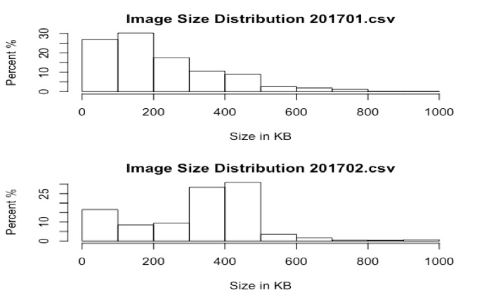

---
class: middle

# Why Do I Learn R?

Why do I learn R when I already know other languages? e.g. Python

* I am more familiar with python
* I spend more time in writing python code because of my job 
* Python is syntactically simplier
* Python is more generic, and preferred among web and system developers
* Python has better performance
* Python has wider adoption, e.g. YouTube, DropBox, Quora, Pinterests, Disqus, Zhihu
* Python has good data science packages, like pandas, nltk, scikit-learn

Above reasons show that Python seems a good candidate
BUT, ...

---
class: middle

# Why Do I Learn R?

Personally, I believe the following are more important to myself:

* Focus on the specific domain
* Accessibility to correct resources

---
class: middle

# Why Do I Learn R?

* R directly does statistics 
* R packages are written by persons who are stronger in statistics
* Direct access to resources: CRAN, R-Bloggers and Books
* Integration with document publishing is superior, even compare with IPython notebook

---
class: middle

# Why Do I Learn R?

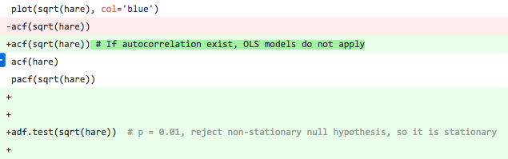
**vs**
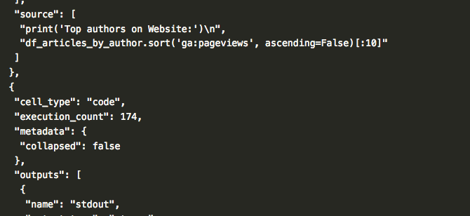

---
class: middle

# Why Do I learn R?

* **Pick the language best fits the need** : 1 + 1 > 2
* I mainly use Python for `raw data processing` because updating and adjusting the input data pretty easy in Python. 
* R is for statistical evaluations. The analytical work is can be performed interactively with the standardized input dataset.

---
class: middle

# The 2nd Case: How I Start to Learn R

##### Find some data that is relevant to your life, e.g. cash balance

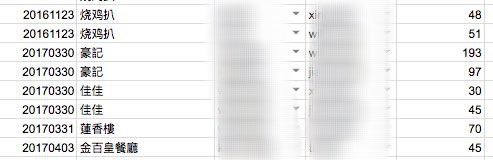

---
class: middle

# The 2nd Case: How I Start to Learn R

* We have a balance sheet for lunch and dinner payments
* Find what you can do with those data in that balance sheet
* I decide to draw a simply wordcloud with R

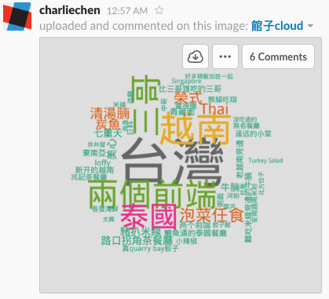

---

class: middle

# The 2nd Case: How I Start to Learn R

* Steps:
  * Take a look at the data structures in the balance sheet
  * Search online how to install R
  * Search what packages can be used to draw a wordcloud
  * Manually clean your data
  * Try it on your own data
  * Share the result with your colleagues

---

class: middle

# The 3rd Case: Learn by Reading and Doing

* I purchased a book on Amazon with the most few pages as I am lazy
  * Learn R in a Day, by Steven Murray: http://amzn.to/2oF3H2K
  * Flip through it
  * Do a few of exercies on it to gain minimum viable skills to do projects
  * Do a real project, either replicate others or do your own, see http://bit.ly/2nHK0mb (**Map Visualisation for Panama Papers and Offshore Leaks in R**)

---

class: middle

# The 3rd Case: Learn by Reading and Doing

* The basic idea is to draw a heatmap on a map:
* Fortunately, we have the detailed addresses in the `Addresses.csv` file
* But unfortunately, a lot of the addresses are malformated, e.g.:
  * `no.84-1418; nanjing road; heping; tianjin; china`
  * `guangdong` vs `guang dong`
  * `zhe jing` vs `zhejiang` 

---

class: middle

# The 3rd Case: Learn by Reading and Doing

* My solution is to calculate the distance between two strings
* R has a package doing the calculation exactly: `stringdist`

---

class: middle

# The 3rd Case: Learn by Reading and Doing

fuzzy match function:

```r
library(stringdist)
fuzzy_province <- function(addrwords, provinces, dist = 0) {
  for(province in provinces) {
    mtr <- stringdistmatrix(addrwords, province)
    for(i in (seq_along(mtr[,1]))) {
      if(i<length(mtr[,1])) {
        # The matrix distance should be equal or shorter than string length of province
        if (mtr[,1][i] + mtr[,1][i+1] <= str_length(province) + dist) {
          if(startsWith(province, addrwords[i]) & abs(str_length(province) - str_length(addrwords[i]) - str_length(addrwords[i+1])) <= dist ) {
            return(province)
          }
        }
      }
    }
  }
  return("")
}
```

---

class: middle

# The 4th Case: Compile a User Survey Report with RMarkdown

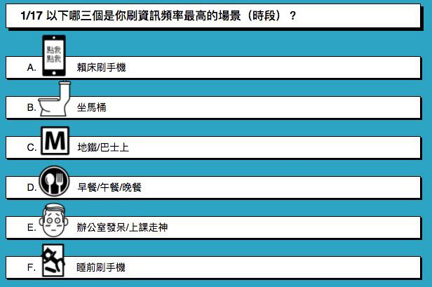

---

class: middle

# The 4th Case: Compile a User Survey Report with RMarkdown

* Two skips are involved in this case:
  * Use Python for raw data cleaning
  * Use R and RStudio to generate report

---

# The 4th Case: Compile a User Survey Report with RMarkdown
##### Raw data processing: sparse matrix

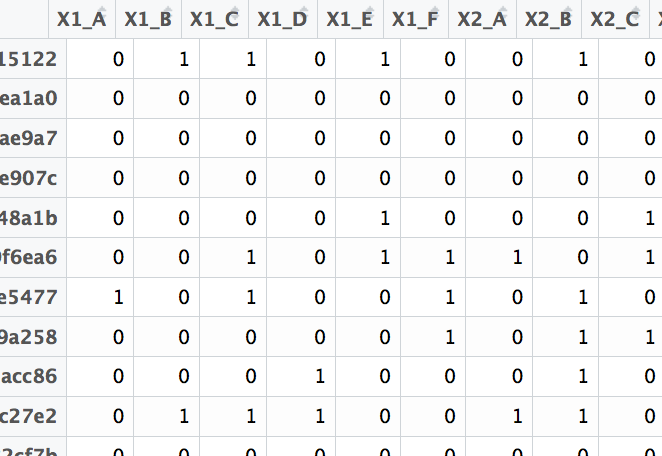


---

class: middle

# The 4th Case: Compile a User Survey Report with RMarkdown

##### Draw a scatter plot

```r
image(sample(trans.survey, 100))
```

---

class: middle

# The 4th Case: Compile a User Survey Report with RMarkdown

##### Calculate Item Frequency and plot the items in both ascending and descending orders

```r
image(sample(trans.survey, 100))

itemFrequencyPlot(trans.survey, topN=10)

barplot(head(sort(itemFrequency(trans.survey), decreasing=F), n=10), las=2)
```

---

class: middle

# The 4th Case: Compile a User Survey Report with RMarkdown

##### Find correlation between categorical variables using `chi-square test` and `contingency table`

```r
# Allow the three libraries contain contingency table functions
library(vcd)
library(descr)
library(gmodels)

tab <- xtabs(~X13_B+X9_A, data=df.yesno)
chisq.test(tab)

ct <- crosstab(df.yesno$X13_B, df.yesno$X9_A, xlab = "Title for Xlab", ylab = "Title for Ylab", chisq=T, expected = T, prop.c = T, plot = F)
plot(ct) 
```

---

class: middle

# The 4th Case: Compile a User Survey Report with RMarkdown

##### Usage of association rules: market basket analysis

{onions, potatos} => {burger}

{diaper} => {beer}

```r
library(arules)
trans.rules <- as(as.matrix(df.answerssem), 'transactions')
rules <- apriori(trans.rules, parameter=list(support=0.015, confidence=0.8, minlen=2))
five.star.rules <- subset(rules, rhs %in% 'star5')
inspect(sort(five.star.rules, by = 'lift')[1:30])
```

---

class: middle

# The 5th Case: Monitor Hosting Platform Cost with Shiny

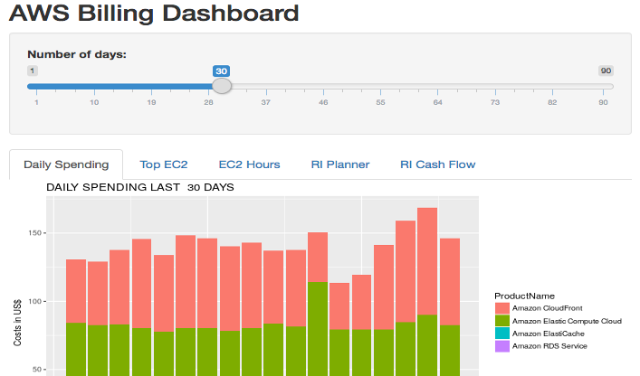

---

class: middle

# The 5th Case: Monitor Hosting Platform Cost with Shiny


* Source Code: [http://github.com/carolusian/aws-billboard]

---
class: middle, center


# The 6th Case: Financial Analytics

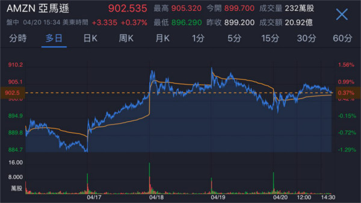

---
class: middle


# The 6th Case: Financial Analytics

* Source Code: [http://github.com/carolusian/fintech]


---

class: middle, center

# Thanks
