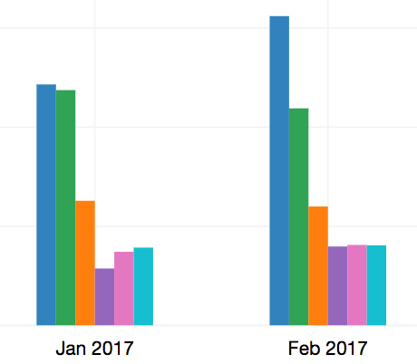

# R Case Studies from a Software Engineer
###### by Charlie Chen ( [@Carolusian](https://github.com/carolusian) )
###### 21 Apr 2017 @ HKBU

---

# The 1st Case: Identify the Reason of a Increase of CDN Cost

* Background
  * News website or apps commonly use card list to display news in a combination of news titles and **images**
  * Images are normally hosted by CDN (Content Distribution Network)
  * CDN service does cost money

---

# The 1st Case: Identify the Reason of a Increase of CDN Cost

* Background
  * One day, I observed there was an increase of the CDN cost (the first blue bar).
       
  * I made a guess: the image size changed
  * I wrote some R code to double check

---

# The 1st Case: Identify the Reason of a Increase of CDN Cost

```bash
aws s3 ls s3://{{bucket_name}}/{{folder_path}} > {{yyyymm.txt}}
cat {{yyyymm.txt}} | awk '{ print $3}' > {{yyyymm.csv}}
```

```r
df <- read.csv('{{yyyymm.csv}}', header=F) / 1024
colnames(df) <- c('size')
df <- df[df$size < 1000, ]

breaks <- seq(from=0, to=1001, by=100)
h <- hist(df, breaks, plot=F)
h$density <- h$counts / sum(h$counts) * 100
plot(h, freq=F, main='Image Size Distribution yyyy.mm', xlab='Size in KB', ylab='Percent %')
```
---

# The 1st Case: 

Parallel plot of image size distribution for different months

```r
files <- list.files()
files <- files[grepl('20.*csv', files) == T]

for(f in files) {
  assign(f, read.csv(f, header=F))
}

par(mfrow = c(length(files), 1))
breaks <- seq(from=0, to=1001, by=100)
for(f in files) {
  df <- get(f) / 1024
  colnames(df) <- 'size'
  df <- df[df$size < 1000, ]
  h <- hist(df, breaks, plot=F)
  h$density <- h$counts / sum(h$counts) * 100
  plot(h, freq=F, main=paste('Image Size Distribution', f), xlab='Size in KB', ylab='Percent %')
}
```

---

# The 1st Case: Back Yourself for a New Feature


---

# Why Do I Learn R?

Why do I learn R when I already know other languages, e.g. Python?

* Python is syntactically simplier
* Python is more generic, and preferred among web and system developers
* Python has better performance
* Python has wider adoption, e.g. YouTube, DropBox, Quora, Pinterests, Disqus, Zhihu
* I am more familiar with python
* I spend more time in writing python code because of my job 
* Python has a google data science packages, like pandas, nltk, scikit-learn

---

# Why Do I Learn R?

* R directly does statistics 
* Direct access to resources: CRAN, R-Bloggers and Books
* R leads the way
* Integration with document publishing is superior, even compare with IPython notebook
* R packages are written by persons who are stronger in statistics

> **Pick the language best fits the need**
> I mainly use Python for `raw data processing` and R for statistical evaluations. Updating and adjusting the input data pretty easy in Python. The analytical work is can be performaned interactively with the standardized input dataset.

----

# The 2nd Case: How I Start to Learn R

##### Find something you can do in your life

---

# The 2nd Case: How I Start to Learn R

* We have a balance sheet for lunch and dinner payments
* Find what you can do with those data in that balance sheet
* I decide to draw a simply wordcloud with R
* Steps:
  * Take a look at the data structures in the balance sheet
  * Search online how to install R
  * Search what packages can be used to draw a wordcloud
  * Manually clean your data
  * Try it on your own data
  * Share the result with your colleagues

--- 

# The 3rd Case: Learn by Reading and Doing

* I purchased a book on Amazon with the most few pages as I am lazy
  * `Learn R in a Day`, by Steven Murray: http://amzn.to/2oF3H2K
  * Flip through it
  * Do a few of exercies on it to gain minimum viable skills to do projects
  * Do a real project, either replicate others or do your own, see http://bit.ly/2nHK0mb (`Map Visualisation for Panama Papers and Offshore Leaks in R`)

---

# The 3rd Case: Learn by Reading and Doing

* The basic idea is to draw a heatmap on a map:
  * Fortunately, we have the detailed addresses in the `Addresses.csv` file
  * But unfortunately, a lot of the addresses are malformated, e.g.:
    * no.84-1418; nanjing road; heping; tianjin; china
    * guangdong vs guang dong
    * zhejiang vs zhejing 
  * The key question: how to clean and standardize the address data in provincial level?

---

# The 3rd Case: Learn by Reading and Doing

* My solution is to calculate the distance between two strings
* R has a package doing the calculation exactly: `stringdist`

---

# The 3rd Case: Learn by Reading and Doing

* Result: TODO

---

# The 4th Case: Compile a User Survey Report with RMarkdown

* Sample Screen Capture: TODO
* Last year we have done a user survey;
* Two skips are involved in this case:
  * Use Python for raw data cleaning
  * Use R to generate report

---

# The 4th Case: Compile a User Survey Report with RMarkdown

* Roughly go through all steps
* Scatter plot is very useful
* Crosstab can helps a lot
* More advanced data mining technic: association rules

---

# The 5th Case: Monitor Hosting Platform Cost with Shiny

* Source Code: []

---

# The 6th Case: Financial Analytics

---

# Some Gists

* Get your hands dirty
* Divide and Conquer you problems